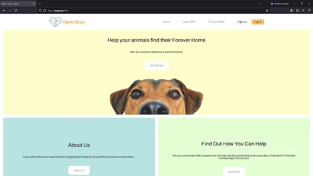
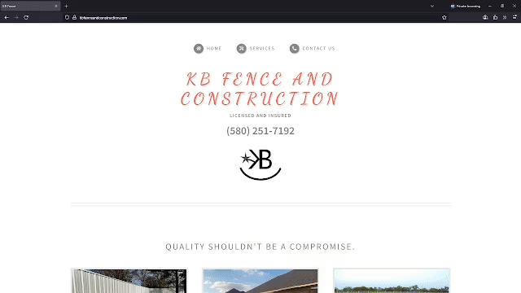
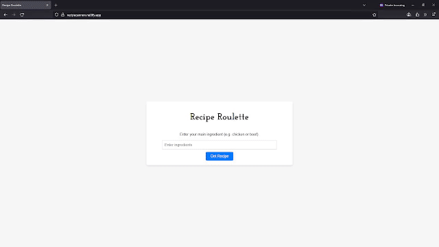
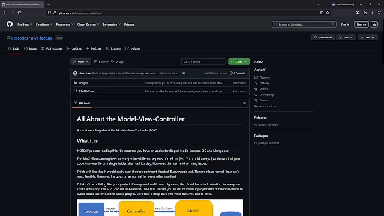

  
  

  
  
  
  

Full-Stack Software Engineer, I enjoy developing solutions that work, with a focus on projects that have a positive impact on the environment, animals, and people.

See [my website](https://loganlyons.me) for more information!

<h1 align="center">Projects</h1>
<table bordercolor="#66b2b2">
  
  <tr>
    <td width="50%" valign="top">
      <h3 align="center">Open Hope</h3>
         
      
         
        

          
    
      

        
<strong>Node.js, MongoDB, React, & Express.js</strong> - A free and open-source platform for shelters to display the animals they have available for adoption or to spin up locally for internal use.

    </td>
    <td width="50%" valign="top">
      <h3 align="center">KB Fence and Construction</h3>
         
      
         
        

          
  
      

        
<strong>Javascript</strong> - A simple, yet effective design for a licensed fence contractor. The goal was to create a way for clients to book consultations and display past projects.

    </td>
  </tr>
  
  <tr>
    <td width="50%" valign="top">
      <h3 align="center">Recipe Roulette</h3>
       
        
       
        

  
  
      

        
<strong>Javascript & TheMealDB API</strong> - A fun recipe generator made with Javascipt and TheMealDB to provide random recipes based on a user provided main ingredient. 

    </td>
    <td width="50%" valign="top">
      <h3 align="center">MVC Lecture</h3>
         
        
         
        

          
  
      

        
<strong>MVC</strong> - A lecture about the Model-View-Controller(MVC) meant to convey when, why and how you would use MVC arcitecture in your projects to address code organization, modularity and maintainability. 

    </td>
  </tr>
</table>

<h1 align="center">Technologies</h1>

    
    
    
    
    
    
    
    
    
    
    

---

<h1 align="center">Connect</h1>

  
  
  
  

